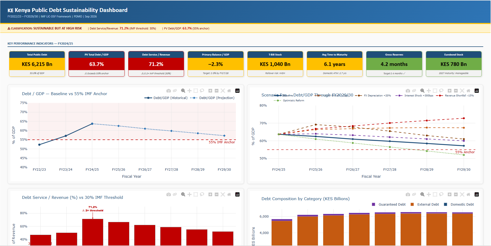

# 🇰🇪 Kenya Public Debt Sustainability Analysis Model
  


[](https://github.com/YOUR_USERNAME/kenya-debt-model/actions)
[](https://www.python.org)
[](LICENSE)
[](https://github.com/psf/black)
[](https://www.imf.org/en/Publications/DSA)

> A production-grade Python implementation of Kenya's Public Debt Sustainability Analysis,
> following the IMF Low-Income Country Debt Sustainability Framework (LIC-DSF 2018).
> Produces a 9-sheet Excel workbook, 3-page PDF executive briefing, sensitivity analysis
> grids, and an interactive Plotly/Dash web dashboard — all from a single config file.

---

## 📋 Table of Contents

- [Key Findings](#-key-findings)
- [What This Produces](#-what-this-produces)
- [Project Structure](#-project-structure)
- [Quick Start](#-quick-start)
- [Usage](#-usage)
- [Model Methodology](#-model-methodology)
- [Configuration](#-configuration)
- [Development](#-development)
- [Data Sources](#-data-sources)
- [License](#-license)

---

## ⚠️ Key Findings

| Indicator | FY2024/25 | IMF Threshold | Status |
|---|---|---|---|
| **Debt Service / Revenue** | **71.2%** | 30% | 🔴 BREACH — 2× threshold |
| PV Total Debt / GDP | 63.7% | 55% | 🔴 BREACH |
| Ext. DS / Exports | 36.6% | 15% | 🔴 BREACH |
| Ext. DS / Revenue | 53.7% | 18% | 🔴 BREACH |
| PV Ext. Debt / GDP | 28.2% | 40% | 🟢 SAFE |
| PV Ext. Debt / Exports | 114.3% | 180% | 🟢 SAFE |

> **Classification: SUSTAINABLE BUT AT HIGH RISK** — Kenya's debt service/revenue ratio of
> 71.2% is more than twice the IMF stress threshold. The PV total debt/GDP anchor of 55%
> has been breached for three consecutive years.

---

## 📦 What This Produces

Running `python run_all.py` generates four outputs:

| Output | Description |
|---|---|
| `outputs/Kenya_Debt_Model.xlsx` | 9-sheet Excel workbook with full model, traffic-light DSA scorecard, stress tests, and 2 embedded charts |
| `outputs/Kenya_Debt_Report.pdf` | 3-page executive briefing with charts, scorecard table, and policy recommendations |
| `outputs/Kenya_Sensitivity.xlsx` | 3 sensitivity grids: Debt/GDP × (Growth, FX), DS/Revenue × (Revenue, Rates) |
| Web Dashboard | Interactive Plotly/Dash app at `http://127.0.0.1:8050` with 7 charts and live heatmap |

---

## 🗂️ Project Structure

```
kenya-debt-model/
├── .github/
│   └── workflows/
│       └── test.yml          # CI pipeline — runs on every push
├── config/
│   └── assumptions.yaml      # ALL model data lives here — edit to update
├── src/
│   ├── model.py              # Core DSA calculations (DebtModel class)
│   ├── excel_writer.py       # 9-sheet Excel workbook generator
│   ├── pdf_writer.py         # 3-page PDF executive report
│   └── sensitivity.py        # Sensitivity analysis engine
├── tests/
│   ├── test_model.py         # 40+ unit tests for core calculations
│   └── test_outputs.py       # Integration tests for file outputs
├── utils/
│   ├── config_loader.py      # YAML config loader with caching
│   ├── logger.py             # Structured logging to terminal + file
│   └── validators.py         # Input validation before any output
├── outputs/                  # Generated files (gitignored)
├── logs/                     # Run logs (gitignored)
├── dashboard_app.py          # Plotly/Dash interactive dashboard
├── run_all.py                # Master entry point
├── requirements.txt          # Runtime dependencies
├── requirements-dev.txt      # Dev/test dependencies
├── setup.cfg                 # Tool configuration (flake8, isort, pytest)
├── .pre-commit-config.yaml   # Pre-commit hooks
├── .env.example              # Environment variable template
├── .gitignore
├── LICENSE
└── README.md
```

---

## 🚀 Quick Start

**1. Clone the repository**
```bash
git clone https://github.com/YOUR_USERNAME/kenya-debt-model.git
cd kenya-debt-model
```

**2. Install dependencies**
```bash
pip install -r requirements.txt
```

**3. Run the full suite**
```bash
python run_all.py
```

Open `http://127.0.0.1:8050` in your browser for the interactive dashboard.

---

## 📖 Usage

### Generate files only (no dashboard)
```bash
python run_all.py --no-dash
```

### Launch dashboard only
```bash
python run_all.py --only-dash
```

### Run individual components
```bash
# Core model + Excel
python -c "from src.model import DebtModel; from src.excel_writer import ExcelWriter; ExcelWriter(DebtModel().compute()).write()"

# PDF report
python -c "from src.model import DebtModel; from src.pdf_writer import PDFWriter; PDFWriter(DebtModel().compute()).write()"

# Sensitivity tables
python sensitivity.py

# Interactive dashboard
python dashboard_app.py
```

### Run tests
```bash
pip install -r requirements-dev.txt
pytest tests/ -v
pytest tests/ -v --cov=src --cov=utils   # with coverage
```

---

## 📐 Model Methodology

### Framework
This model implements the **IMF Low-Income Country Debt Sustainability Framework (LIC-DSF)**,
2018 vintage, under the **Strong Policy Space** classification.

### Six Threshold Indicators

| # | Indicator | Threshold |
|---|---|---|
| 1 | PV External Debt / GDP | 40% |
| 2 | PV External Debt / Exports | 180% |
| 3 | PV External Debt / Revenue | 250% |
| 4 | External DS / Exports | 15% |
| 5 | External DS / Revenue | 18% |
| 6 | PV Total Debt / GDP | 55% |

### Present Value Calculation
External debt is discounted using a concessionality factor: the eligible portion (60%)
receives a 30% PV haircut, yielding an effective 18% discount on total external debt.

### Six Stress Scenarios
| Scenario | Key Shock |
|---|---|
| Baseline | Gradual fiscal consolidation |
| Lower Growth | Real GDP 2pp below baseline |
| FX Depreciation | KES depreciates 20% in FY25/26 |
| Interest Rate Shock | +300bps on domestic yields |
| Revenue Shortfall | Revenue 15% below baseline (Finance Bill analog) |
| Optimistic Reform | Improved compliance + concessional financing |

---

## ⚙️ Configuration

All model data is stored in **`config/assumptions.yaml`**. To update the model:

1. Open `config/assumptions.yaml`
2. Edit the relevant series (e.g., GDP, debt stock, interest rates)
3. Run `python run_all.py --no-dash`

```yaml
# Example: update GDP projection
real_sector:
  nominal_gdp_kes_bn: [12100, 13200, 14400, 15800, 17300, 18900, 20600, 22400]
  real_gdp_growth_pct: [4.8, 5.6, 5.4, 5.6, 5.8, 6.0, 6.0, 6.0]
```

No Python code needs to change. The validators will catch any data errors before output.

---

## 🛠️ Development

### Setup
```bash
pip install -r requirements.txt
pip install -r requirements-dev.txt
pre-commit install
```

### Code Quality
```bash
black src/ utils/ tests/         # auto-format
flake8 src/ utils/               # lint
isort src/ utils/ tests/         # sort imports
```

### Running the CI pipeline locally
```bash
pre-commit run --all-files
pytest tests/ -v --tb=short
```

---

## 📊 Data Sources

| Data | Source |
|---|---|
| GDP, Revenue, Expenditure | [National Treasury Kenya — Budget Statements](https://www.treasury.go.ke) |
| Debt Stock Composition | [PDMO Debt Bulletin](https://www.pdmo.go.ke) |
| External Creditor Data | [World Bank IDA, AfDB, IMF Staff Reports](https://www.worldbank.org) |
| IMF Thresholds | [IMF LIC-DSF Framework 2018](https://www.imf.org/en/Publications/DSA) |
| T-bill & Bond Rates | [CBK Market Data](https://www.centralbank.go.ke) |
| Exchange Rates | [CBK Monetary Policy Reports](https://www.centralbank.go.ke) |

---

## 📄 License

MIT License — see [LICENSE](LICENSE) for details.

**Disclaimer:** This model is for analytical and research purposes only.
Projections are model outputs subject to revision. For official debt statistics
refer to [PDMO published bulletins](https://www.pdmo.go.ke).

---

*Built with Python · openpyxl · reportlab · Dash · Plotly*
*Framework: IMF LIC-DSF 2018 · Prepared by PDMO · September 2026*
